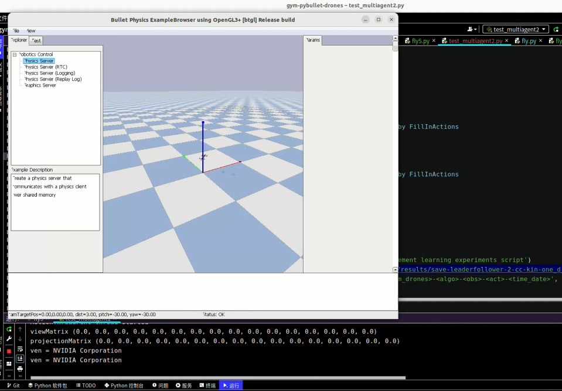
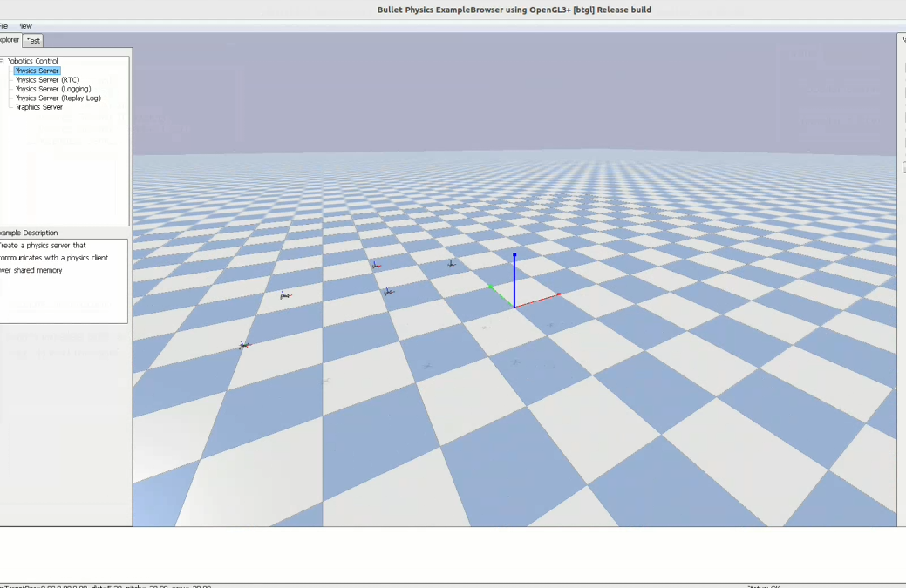

# boids-pe
Boids-PE: A Deep Reinforcement Learning Approach for UAV Pursuit-Evasion: Integrating Boids Model and Apollonian Circles

:star: :star: :star: :star: :star:

## To run  script ''test_multiagent7-test.py'', type in a terminal:
```python test_multiagent<7-test>.py --exp ./results/save-<env>-<num_drones>-<algo>-<obs>-<act>-<time_date>```

***
> Movement information of a drone in a one-on-one (one-dimensional) self-game framework for pursuit and evasion.

[][1to11d-res]

***

> Movement information of a drone in a one-on-one (three-dimensional) self-game framework for pursuit and evasion.

[][1to13d-res]

***
> To better demonstrate the actual effects of the drone pursuit-evasion task, the following video showcases a one-on-one drone pursuit-evasion experiment conducted in a three-dimensional space.

[][1to13d-picture]

See 

[][1to13d-video]

Or click [this](https://github.com/albert-jin/boids-pe/blob/main/videos/1v.s.1-v1.mp4).

***

> To better demonstrate the actual effects of the drone pursuit-evasion task, the following video showcases a multiple(many)-on-one drone pursuit-evasion experiment conducted in a three-dimensional space.

[][4to13d-picture]

See 

[][4to13d-video]

Or click [this](https://github.com/albert-jin/boids-pe/blob/main/videos/4v.s.1-v1.mp4).

***

# Thanks!

### Star and Fork. 